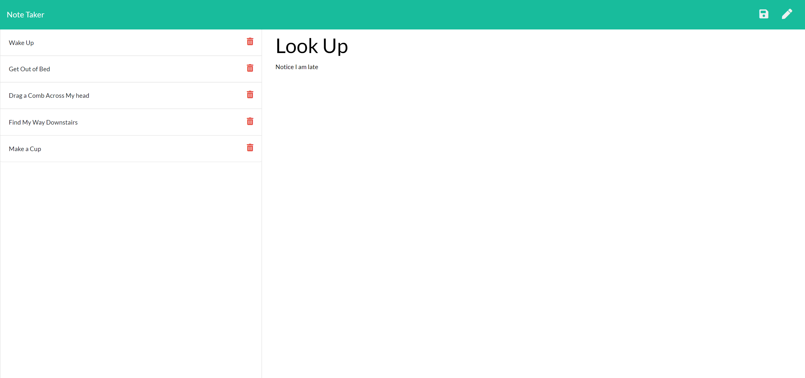

# NoteTaker

---

## Table of Contents
- [Description](#description)
- [Installation](#installation)
- [Testing](#testing)
- [Questions](#questions)
- [License](#license)

---

## Description
This application is a Node.js and Express based note taker deployed via a server. The application takes values for the Note Title and Note Text from the user and updates the application's database file, then posting them back on the sidebar for the user to view and manage. 

---

## Installation
As this program uses Node.js, Express, and UUID dependencies, you will want to open an integrated terminal in the project folder to installe those. First, you'll need to install package.json by typing "npm init -y" into the terminal. Then, install the node modules by typing "npm i" into the terminal. After that, we'll want to install the express dependency so type "npm i express" into the terminal. Finally, to install the UUID dependency type "npm i uuid" into the terminal.  

---

---

## Testing
Testing files are not provided but can be done when forking and cloning the repository to your computer.  

---

## Questions
GitHub username: [CJSerame24](https://github.com/CJSerame24)

Email address: carloserame24@gmail.com

---

## License
